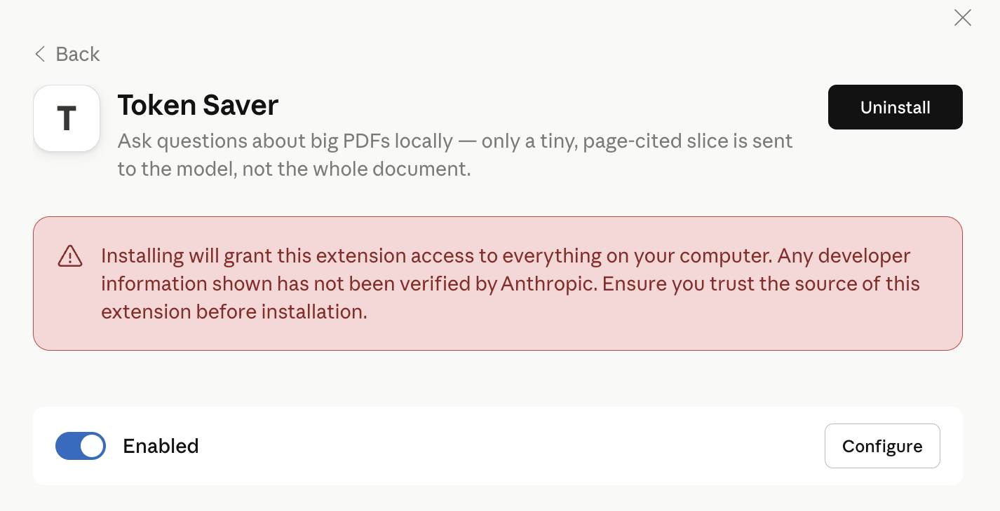
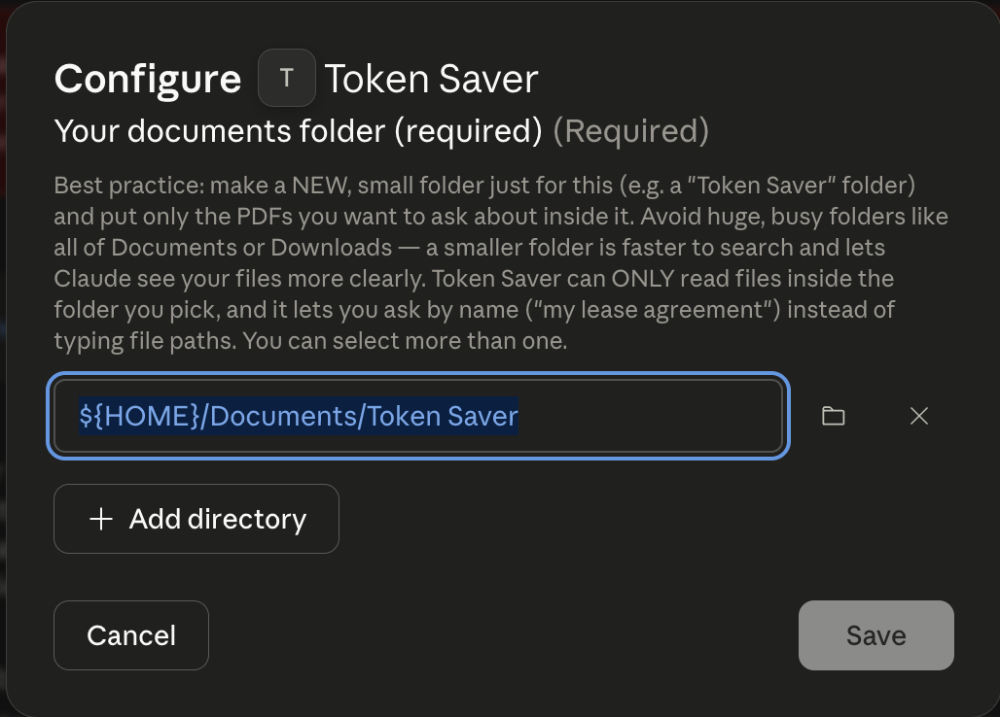
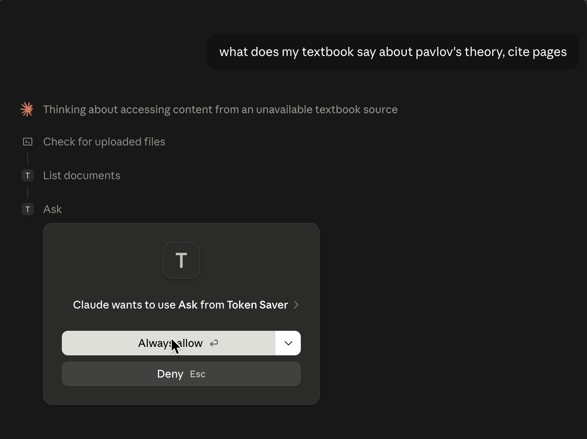
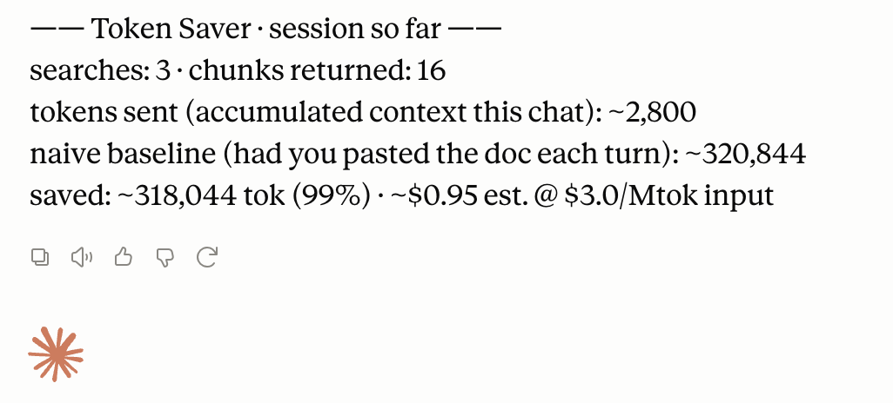

<p align="center">
  <a href="https://github.com/Marktechpost/Token-Saver/releases">
    
  </a>
  <a href="https://github.com/Marktechpost/Token-Saver/blob/main/LICENSE">
    
  </a>
  <a href="https://python.org">
    
  </a>
  <a href="https://linkedin.com">
    
  </a>
</p>

# Token Saver

Developed at Marktechpost AI Media Inc by [Arnav Rai](https://www.linkedin.com/in/arnav-rai-475033243/) (CS student at Rochester Institute of Technology) during his internship at Marktechpost, supervised by [Jean-marc Mommessin](https://www.linkedin.com/in/contactjmm/) and [Asif Razzaq](https://www.linkedin.com/in/asifrazzaq/).

A local Claude Desktop extension to query large PDFs with **92–98%** fewer tokens. Performs local hybrid search, cites exact page numbers, and keeps your documents private on your machine

Token Saver is a **one-click Claude Desktop extension** (`.mcpb`). It reads a PDF
on your computer, finds the passages that answer your question, and hands the
model just those — with page citations. Cheaper, and often *more accurate*,
because a model buried in 200 irrelevant pages reasons worse than one handed the
right two paragraphs.

---

## The idea

**Keep bulk data out of the context window. Do the searching in local code. Bring
only a precise, verified, page-cited slice into the model's reasoning.**

This wins on two fronts at once:

- **Cost** — context is re-sent on every turn, so a 200-page PDF pasted into a
  chat is re-paid on every follow-up. A small slice is paid once.
- **Accuracy** — a model buried in irrelevant text reasons worse; relevant facts
  get lost in the middle. A tight, on-point context is more reliable.

The whole job is to **retrieve precisely**, **cite everything**, and **abstain
rather than guess** when nothing matches.

---

## Install & use

No Python, no Terminal, no config files — the extension bundles everything.

1. Download **`token-saver-ccr.mcpb`** from the [Releases](https://github.com/Marktechpost/Token-Saver/releases/tag/version1) page.
2. Claude Desktop → **Settings → Extensions → Install extension** → pick the file.
   (A red "not verified by Anthropic" warning is normal for any extension
   installed from a file — see the [install guide](INSTALL_GUIDE.md#step-1--install-the-extension).)
3. Switch the **Enabled** toggle on.
4. **Required:** click **Configure** and choose a small, dedicated folder holding
   the PDFs you want to ask about (not all of Documents or Downloads).
5. On your first question, Claude asks permission to use the tool — choose
   **Always allow**. That first run also downloads the RAG based search engine once
   (2–5 minutes); after that it's fast.

| After installing | Choosing your folder | First question |
|---|---|---|
|  |  |  |
| The red warning is standard for any extension installed from a file. Toggle **Enabled** on. | Point it at a **small, dedicated folder** — not all of Documents. | Choose **Always allow**, or you'll be asked on every question. |

**Step 4 is what makes it work.** That folder is the safety boundary, it's how you
ask by name instead of typing paths, and at startup the extension tells Claude
which documents you have — so a well-known title resolves to *your* copy, not
Claude's memory of the published edition.

Then just talk to Claude — no paths, no commands, no "ingest":

> What does **my** lease agreement say about the termination clause? **Cite the pages.**

Claude reads the closest matching file and answers with page numbers in one step,
naming the file it used ("Reading lease-agreement.pdf…"). If it picks the wrong
one, say *"no, I meant the other"*; if several match closely it shows a short list
to choose from. Follow-ups reuse the loaded document for 30 minutes. Every answer
ends with an estimated running savings block. Say *"list my documents"* or *"clear
everything"* to switch.

> **Two habits:** say **"my"** (my report, my lease) so Claude knows you mean your
> file, and ask it to **cite the pages** — a real citation can only come from your
> document, so it's both the trigger and the proof.

**Which model?** Any current Claude model works — Opus, Sonnet and Haiku were all
tested end to end. Sonnet or Opus is recommended; Haiku works and still cites
pages, but expect about one extra correction turn on an ambiguous request. Details
in [INSTALL_GUIDE.md](INSTALL_GUIDE.md#which-claude-model-should-i-use).

Beginner walkthrough, screenshots, and a 6-test check that it's working:
**[INSTALL_GUIDE.md](INSTALL_GUIDE.md)**. If the AI model can't load, retrieval
degrades automatically to word-matching and says so — nothing to configure.

---

## What it saves, honestly

Every answer ends with a running total of what you saved:



Retrieval quality was measured on real documents (the 213-page *Dobbs v. Jackson*
opinion and the 152-page Berkshire Hathaway 2023 annual report); full methodology
in [`eval/RESULTS.md`](eval/RESULTS.md).

Measured **2026-07-25** on 30 author-written gold questions over the two real
documents (not yet human-verified). Reproduce them yourself with the commands in
[Reproduce these numbers](#reproduce-these-numbers).

| Metric | Result |
|---|---|
| Retrieval recall@5 (hybrid) | **0.90** — answer page in the top 5 for 27/30 questions |
| False-abstain rate | **0.00** — no on-topic question wrongly refused |
| Keyword-only recall@5 | **0.90** — the automatic no-model fallback |
| SEM_FLOOR sweep 0.15→0.35 | recall **flat at 0.90**, abstain flat at 0.00 |
| Unit tests | **index 18 · server 106**, all passing |

> **These numbers changed.** Earlier versions of this README reported hybrid
> **0.97** / keyword **0.93** from a 2026-07-09 run. Those no longer reproduce.
> The corpus was verified **byte-identical** (both files match their pinned
> sha256 and page counts), so this is not corpus drift — it is the effect of
> retrieval changes shipped since, chiefly query-side stop words, light
> stemming, and the eligibility gate. The current figures are what the harness
> prints today. Details and the per-question breakdown:
> [`eval/RESULTS.md`](eval/RESULTS.md) §1.
>
> Hybrid and keyword-only now tie at 0.90 but **miss different questions** —
> semantic uniquely catches paraphrases like "operating earnings recent years"
> and "stare decisis"; keyword uniquely catches "does the company pay a dividend"
> and "Washington v. Glucksberg". One question misses in both.

**Token savings depend entirely on document size** — the returned slice is roughly
constant (~2.5k tokens for several questions) no matter how big the file is, so the
saving grows with the document. Measured with `tiktoken` on the real server path:

| Document | vs pasting it once | vs re-pasting each turn |
|---|---|---|
| ~20 pages | ~14% | ~83% |
| ~80 pages | ~78% | ~96% |
| ~300 pages | ~94% | ~99% |

The crossover is around **15–20 pages**: below that, the slices can cost *more*
than the file, so Token Saver isn't worth it for small documents. Trust the
**percentage** and the direction; treat absolute token/dollar figures as
estimates (a proxy tokenizer, and a headline baseline that assumes re-pasting
every turn — and that charges every loaded document on every search). The
per-number breakdown is in
[`references/mcp-server.md`](references/mcp-server.md#the-savings-math-and-how-far-to-trust-it).

### Known limitations

Stated plainly, because you should know them before trusting it:

- **The abstain gate keys on keyword presence.** A query sharing incidental
  words with an off-topic passage can still surface that passage — a
  *false accept*. Check the citations. Tracked as a known defect:
  [`docs/known-issues/false-accept-abstain-gate.md`](docs/known-issues/false-accept-abstain-gate.md).
- **Picking the right file is the weaker half.** On a real 16-PDF folder the
  resolver opened the correct document for **12 of 14** requests. Retrieval
  *within* a correctly-chosen file is reliable; choosing the file is where it
  fails.
- **A generic noun can pick the wrong book.** With two ~1000-page textbooks in
  one folder, *"what does **the textbook** say about Pavlov"* resolves to the
  wrong one — "textbook" is in neither filename and Pavlov appears in neither
  book's first pages. Naming the subject fixes it: *"my **psychology** textbook"*
  resolves correctly. In live testing Sonnet phrases it well or self-corrects;
  Haiku needed **one correction turn** ("list my documents", then ask again).
  So it is a recoverable misroute, not a dead end.
- **Page-only citations give no section provenance.** In a ruling with a
  majority plus dissents, the model must infer which side a passage came from —
  and can get it wrong.

Full cross-model results: [`eval/RESULTS.md`](eval/RESULTS.md) §5.

---

## Reproduce these numbers

Every figure above comes from these three commands. The eval downloads its own
corpus (the two real PDFs, ~30 MB) and verifies them against pinned sha256
hashes, so you are scoring the same bytes this README was measured on.

```bash
python tests/mcp_selftest.py            # expect: RESULT: 106 passed, 0 failed
python tests/index_selftest.py          # expect: RESULT: 18 passed, 0 failed
python eval/retrieval_eval.py --download   # expect: recall@5 0.90, false-abstain 0.00
```

Expected output of the third command:

```
# Retrieval eval  (3 doc(s): synthetic, berkshire, dobbs)
mode: hybrid (semantic+keyword)

recall@5       : 0.90  (30 gold questions)
false-abstain  : 0.00
```

Two optional cross-checks (run these *after* the `--download` above, which
leaves the corpus in `eval/corpus/`):

```bash
python eval/retrieval_eval.py --keyword-only --download                # no-model floor: also 0.90
python eval/retrieval_eval.py --sweep-floor 0.15:0.35:0.05 --download  # flat at 0.90 across the range
```

> **If you see `recall@5 1.00 (10 gold questions)`**, the real PDFs weren't
> downloaded and you're scoring the built-in synthetic document only — that is
> not the published figure. The harness prints a loud warning when this happens.
> Add `--download`.

The gold answer labels live in [`eval/gold/`](eval/gold/) and are committed, so
the run is fully reproducible; only the two source PDFs are fetched at runtime
(`eval/corpus/` is gitignored deliberately — they are large and redistributable
from their original sources).

---

## How it works

```
   your question
        |
        |--> keyword (BM25, stemmed) -----+
        |                                 +--> blend 0.4/0.6 --> abstain gate
        |--> local embedding (cosine) ----+          |
        |                                            v
        |                              dedup --> trim --> budget --> top-K cited chunks
        v
   only those few paragraphs ever reach the model; the PDF never does
```

Extraction → 180-word overlapping chunks → local embedding → hybrid scoring →
sentence-window trimming, all inside one resident local process that holds the
index in RAM and evicts it after 30 idle minutes. The embedding half is optional:
without it the server falls back to keyword-only scoring (both measure recall@5
0.90 today, but they miss different questions — see above).

The rationale for each choice — the 0.4/0.6 blend, the abstain gate, the
trimming window count, document resolution, every tuning knob, and how each
reported number is counted — is in
**[`references/mcp-server.md`](references/mcp-server.md)**; the security envelope
is in **[SECURITY.md](SECURITY.md)**.

---

## What's inside

```
token-saver/
|- INSTALL_GUIDE.md       # plain-English install, use, and 6 checks (start here)
|- CHANGELOG.md           # what changed, and which version has which fix
|- SECURITY.md            # threat model: folder allowlist, prompt-injection
|- docs/known-issues/     # open defects, written up honestly
|- mcpb/manifest.json     # the extension manifest (tools, folder picker)
|- scripts/
|   |- mcp_server.py      # the server: ask/list_documents/ingest/search/clear/status/savings
|   |- index_store.py     # extraction, chunking, embedding, SQLite index
|   |- retrieve.py        # BM25 + stemming + stop words (shared scorer)
|   |- pdf_inspect.py     # dev CLI: inspect a PDF, pre-build the disk index
|   `- build_mcpb.sh      # builds dist/token-saver-ccr.mcpb   <- how you ship
|- docs/images/           # screenshots used by the guides
|- tests/                 # mcp_selftest, index_selftest
|- eval/                  # retrieval_eval (recall@5 / abstain) + RESULTS.md
`- references/            # tool reference + tuning knobs, bundle build/release runbook
```

**Shipping = one file.** `bash scripts/build_mcpb.sh` produces
`dist/token-saver-ccr.mcpb`; that single file is everything a user installs.
Build / sign / release runbook: [`references/mcpb-bundle.md`](references/mcpb-bundle.md).
Tool reference and environment knobs: [`references/mcp-server.md`](references/mcp-server.md).

---

## Verifying it yourself (developers)

```bash
python tests/mcp_selftest.py       # server logic, security, savings, trimming
python tests/index_selftest.py     # index build/query/freshness (both extractors)
python eval/retrieval_eval.py      # recall@5 / false-abstain on the gold set
```

---

## Privacy

Documents stay on your machine. Extraction and search run locally; the local
embedding model needs no internet after its first download; only the few
answering passages ever reach the model. The extension's folder picker restricts
which folders it may read (see [`SECURITY.md`](SECURITY.md)) — files outside them
are refused.

## License

MIT — use, modify, and share freely.
